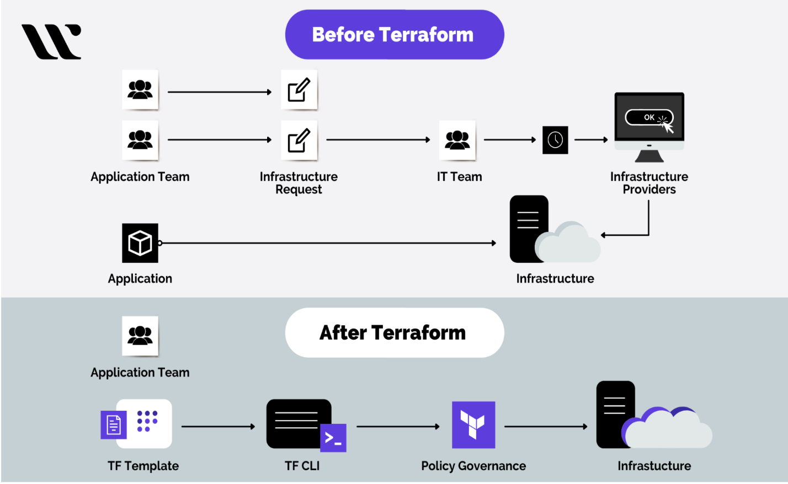
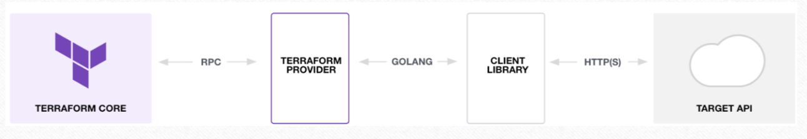
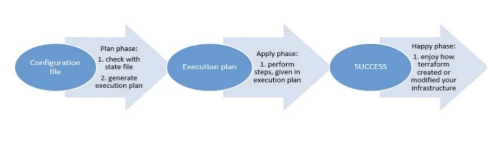
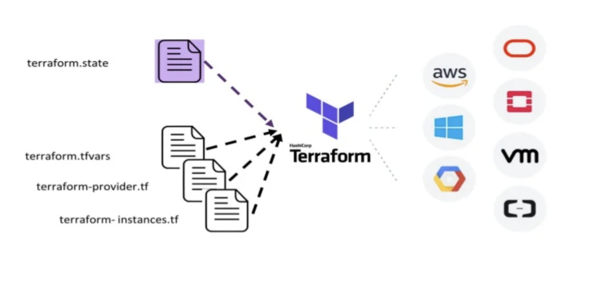

# Terraform Providers: A Practical Introduction

If you have managed infrastructure using cloud dashboards or custom scripts and found it hard to scale, this guide is for you.

## Overview

This document explains how Terraform works, why providers matter, and how the Terraform workflow (`init`, `plan`, `apply`, `destroy`) helps teams manage infrastructure reliably.

## What You Will Learn

- What Terraform is and why teams use it
- Why Terraform is often preferred over GUI-based and script-only workflows
- What Terraform providers are and how they connect Terraform to external systems
- How to use a basic Terraform workflow from initialization to cleanup
- What happens under the hood during planning and execution
- Where Terraform fits compared to alternatives

## The Problem: Infrastructure Management Does Not Scale Easily

Assume you need to:

- Create a storage bucket
- Spin up compute instances
- Configure access controls

### Option 1: Cloud GUI (Console)

- Click-heavy and manual
- Hard to review change history
- Difficult to reproduce consistently

### Option 2: APIs or Custom Scripts

- Flexible but often verbose
- Harder to maintain over time
- No built-in, unified state tracking by default

> **Note**
> Both approaches become harder to manage as environments and teams grow.

## The Solution: Terraform

Terraform is an open-source Infrastructure as Code (IaC) tool that lets you define infrastructure in code using HCL (HashiCorp Configuration Language).

| Approach | Flow |
| --- | --- |
| Traditional | Clicks or scripts -> Infrastructure |
| Terraform | Code -> Terraform -> Infrastructure |



### Why Terraform

- **Speed and consistency**: Automates provisioning and reduces manual setup
- **Collaboration**: Infrastructure definitions live in Git and support team workflows
- **Reduced errors**: Standardized configurations minimize drift and mistakes
- **Recovery friendly**: Re-apply known configuration to rebuild environments

## Terraform Providers

Terraform manages external resources through **providers**.

Flow:

`Terraform -> Provider -> API -> Resource`



| Component | Role |
| --- | --- |
| Terraform | Core engine that evaluates desired state |
| Provider | Connector/translator for a target platform |
| API | External service interface |
| Resource | Actual infrastructure object managed by Terraform |

### Core Building Blocks

| Component | Purpose |
| --- | --- |
| Provider | Connects Terraform to a target system |
| Resource | Defines what to create or manage |
| Module | Reusable group of Terraform configurations |
| State | Tracks real-world infrastructure managed by Terraform |

## Example Configuration

Instead of manually clicking through a console, define desired resources in code:

```hcl
provider "aws" {
  region = "us-east-1"
}

resource "aws_s3_bucket" "example" {
  bucket = "my-demo-bucket"
}
```

You declare **what** you want; Terraform determines **how** to apply the changes.

> **Note**
> Terraform is primarily **declarative**, not imperative.

## Terraform Lifecycle

Typical workflow:

`init -> plan -> apply -> destroy`

| Command | What It Does |
| --- | --- |
| `terraform init` | Downloads provider plugins and initializes the working directory |
| `terraform plan` | Compares desired vs current state and shows proposed actions |
| `terraform apply` | Executes the approved plan by calling provider APIs |
| `terraform destroy` | Removes resources managed by the current configuration |



## What Happens Under the Hood

Terraform execution model:

1. Reads desired state from configuration files
2. Reads current state from Terraform state and provider APIs
3. Computes the difference (execution plan)
4. Applies required create/update/delete actions



In short:

`Desired State + Current State -> Plan -> Execute`

## Real-World Use Cases

- **Kubernetes**: Manage clusters and deploy workloads
- **Multi-cloud environments**: Coordinate AWS, Azure, and GCP resources
- **Internal platforms and SaaS integrations**: Manage custom or third-party services through providers

Example provider reference:

- [VMware Tanzu Mission Control Terraform Provider](https://registry.terraform.io/providers/vmware/tanzu-mission-control/latest/docs)

## Terraform vs Alternatives

| Tool | Style | Notes |
| --- | --- | --- |
| Terraform | Declarative | Broad multi-cloud ecosystem, provider-driven |
| Pulumi | Code-based | Uses general-purpose languages |
| CloudFormation | Declarative | AWS-native and AWS-focused |

## Next Steps

- Install Terraform and run through a local sample project
- Explore providers in the [Terraform Registry](https://registry.terraform.io/)
- Learn module patterns for reusable infrastructure
- Add remote state and CI/CD for team-scale workflows
